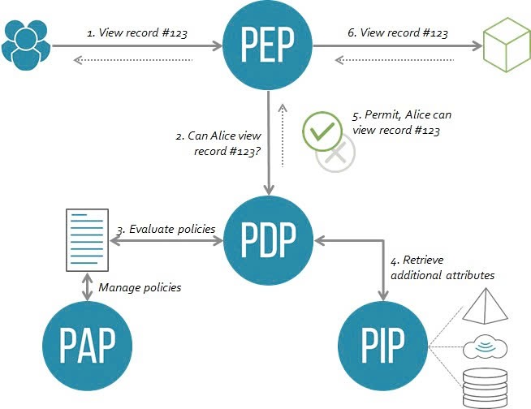

# 1. Giới thiệu

Chào mừng bạn đến với thư viện phân quyền ABAC. Tài liệu này sẽ giúp bạn hiểu rõ về kiến trúc và các khái niệm cốt lõi của thư viện.

## ABAC là gì?

**Attribute-Based Access Control (ABAC)** là một mô hình phân quyền trong đó quyền truy cập được cấp dựa trên việc đánh giá các **thuộc tính** (attributes). Thay vì gán quyền cố định cho người dùng (như trong RBAC), ABAC sử dụng một bộ **chính sách** (policies) để đánh giá các thuộc tính của:
* **Subject**: Người dùng hoặc hệ thống yêu cầu truy cập.
* **Resource**: Đối tượng hoặc dữ liệu đang được yêu cầu.
* **Action**: Hành động đang được thực hiện (read, write, approve,...).
* **Environment**: Ngữ cảnh của yêu cầu (thời gian, địa chỉ IP,...).

Cách tiếp cận này mang lại sự linh hoạt tối đa để thể hiện các quy tắc nghiệp vụ phức tạp.

## Kiến trúc thư viện

Thư viện được thiết kế theo kiến trúc ABAC tiêu chuẩn. Sơ đồ dưới đây minh họa luồng xử lý của một yêu cầu truy cập:



Các thành phần trong sơ đồ tương ứng với các phần trong thư viện của chúng ta như sau:
* **PEP (Policy Enforcement Point)**: "Người gác cổng". Đây là **Middleware** trong ứng dụng của bạn, nơi chặn các yêu cầu và gọi `authorizer.Check()`.
* **PDP (Policy Decision Point)**: "Bộ não". Đây là struct `Authorizer` của thư viện, nơi nhận yêu cầu từ PEP, điều phối việc lấy thuộc tính và dùng Casbin để ra quyết định cuối cùng.
* **PIP (Policy Information Point)**: "Người cung cấp dữ liệu". Đây là các struct `Fetcher` mà bạn triển khai để cung cấp thuộc tính của Subject và Resource từ database hoặc các nguồn khác.
* **PAP (Policy Administration Point)**: "Người quản lý chính sách". Struct `PolicyManager` cung cấp một giao diện API để bạn quản lý (thêm, xóa, sửa, tải lại) các policy.

```plaintext
abac/
├── authorizer.go      # Chứa Authorizer (PDP) và các hàm khởi tạo hệ thống
├── policy_manager.go  # Chứa PolicyManager (giao diện cho PAP)
├── functions.go       # Chứa các hàm tùy chỉnh (has, intersects,...)
├── interfaces.go      # Chứa các interface Fetcher (định nghĩa cho PIP)
└── errors.go          # Chứa các lỗi tùy chỉnh
```